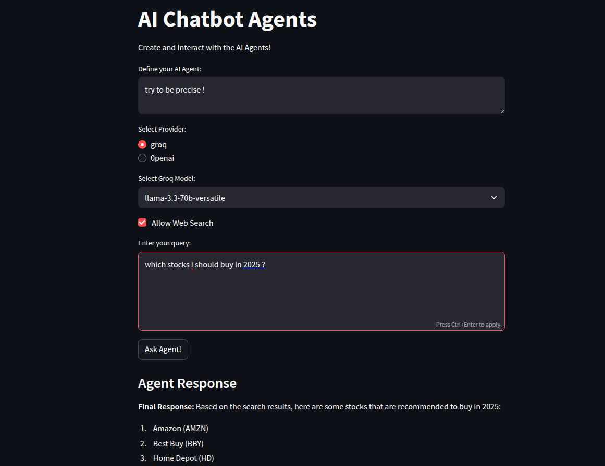

# 🧠 Agentic Chatbot with FastAPI, LangGraph, and Streamlit

This project is an **AI-powered chatbot interface** built with **FastAPI**, **LangGraph**, and **Streamlit**. It allows users to interact with various LLMs (like Groq's LLaMA and OpenAI's GPT-4o-mini), and optionally enhances responses with **live web search** using Tavily.

---

## 🚀 Features

- 📦 Modular **FastAPI** backend with support for dynamic model selection
- 🧩 Integration with **Groq** and **OpenAI** via LangChain
- 🔍 Web search support using **Tavily** for real-time info
- 🖥️ **Streamlit UI** for smooth user experience
- ✅ Simple and scalable design using `pydantic` and reactive agents

---

## 🧰 Tech Stack

| Layer       | Tools                             |
|-------------|------------------------------------|
| Frontend    | Streamlit                          |
| Backend     | FastAPI, Pydantic                  |
| LLMs        | Groq (LLaMA), OpenAI (GPT-4o-mini) |
| Search Tool | Tavily Search API                  |
| Agent Logic | LangGraph, ReAct Agent             |

---

## 📁 Project Structure

```bash
├── main.py                # FastAPI backend
├── ai_agent.py            # AI agent setup using LangGraph
├── frontend_app.py        # Streamlit UI interface
├── requirements.txt
├── .env                   # API keys (excluded via .gitignore)
└── README.md
```

## 🖼️ UI Screenshot



